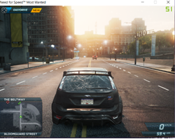
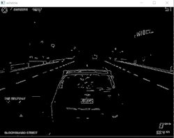
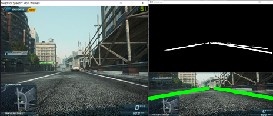

# Self-Driving Car in Need for Speed : Most Wanted 2012 Game

Dependencies : 

```
Numpy                    1.14.5
Pyautogui                0.9.42
OpenCV                   4.1.2
Tensorflow               1.10.0
```

+ Run the game on 800 x 600 resolution ( Changing this requires you to reshape the Region Of Interest )
+ Run the COMBINED.py File on any Python IDE once in-game.
+ The Car will drive itself and stay within the road limits while detecting and avoiding incoming traffic.


#### Game View 




#### Edge Detection Algorithm to acquire necessary data




#### Lane Finder Algorithm to help ensure the car stays within bounds



Thank you!
